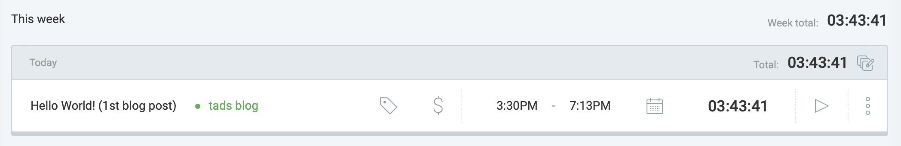

```{r setup, include=FALSE}
knitr::opts_chunk$set(echo = FALSE)
library(tidyverse)

# Learn more about creating blogs with Distill at:
# https://rstudio.github.io/distill/blog.html
```

# Welcome to my blog

Les comparto el comienzo de mi aventura acerca de cómo desarrollar habilidades
para el análisis de datos. Durante los últimos meses me surgió un interés
por el montón de cosas que se pueden realizar con el lenguaje de programación
de R; desde accesar a bases de datos, programar modelos estadísticos, limpiar
datos, diseñar visualizaciones muy creativas, escribir un libro, hasta mantener
tu propio blog en línea en una página web. Realmente no conozco hasta donde 
llegan los límites de esta herramienta. 

Para los fans de realizar análisis de datos en Python, también es posible correr 
código de este lenguaje en Rstudio y así tener acceso a lo mejor de los dos
mundos. Por esto, les aviso que también podrán encontrar, en algún momento,
material interesante sobre las distintas utilidades que tiene Python en este blog. A continuación les muestro un gráfico sobre la percepción actual que
tengo sobre mi nivel de manejo en estos dos lenguajes:

```{r}
software <- c("R", "Python")
n <- c(.46, .10)

tibble(software, n) %>% 
  ggplot(aes(software, n)) +
  geom_col(width = 0.1, fill = "dark blue") +
  coord_flip() +
  geom_point(size = 10, color = "dark blue") +
  scale_y_continuous(labels = scales::percent, limits = c(0,1)) +
  labs(x = NULL,
       y = NULL,
       title = "Mi conocimiento en R vs. Python")+
  theme_light() +
  theme(plot.title = element_text(size = rel(2), family = "serif"),
        axis.text.y = element_text(size = rel(2), family = "mono"))
  
```

## ¿Por qué el blog?

La principal razón es documentar mi progreso. Por lo que experimenté los días
antes de comenzar, ya es suficiente difícil buscar recursos para aprender solo
y mantenerse motivado. La disciplina de mantener el blog activo me obliga a
estar pendiente de aprender cosas nuevas y generar contenido claro y valioso
para cualquiera que esté al tanto. En un futuro este blog le puede servir a
alguien más que quiera aprender a hacer sus propios análisis como una guía de
por donde empezar.

Me interesa interactuar con la comunidad. La mejor forma de aprender a hacer
algo es tener a alguien con quién explorar tus ideas. Al exponer mis análisis
y trabajos en este medio espero incentivar a mis amigos y conocidos a que me
contacten si necesitan ayuda desarrollando algún proyecto o simplemente para
sugerirme algún tema para escribir una publicación en el futuro.

## La visión de este blog

Apenas es el comienzo, los planes que tengo sobre el futuro del blog son los
siguientes:

#### Paso 1. Generar el hábito y medir mis habilidades:

Mantener el blog es todo un reto más allá de solo saber cómo programar, también
necesito practicar mis destrezas como comunicador de ideas y creatividad en mi
selección de temas, gráficos y paletas de colores. 

Imaginense que tan solo esta rápida publicación me tomó más de 4 horas mientras
elegía los colores de la página e intentaba arreglar unos problemas con los
chunks de código que no logré arreglar por completo, en fin... ya lo notarán
luego.

Por esta razón el objetivo es utilizar una aplicación como https://clockify.me/
para medir cuanto tiempo me toma realizar los posts con el fin de poco a poco
ir notando mejoras en mi progreso. En el Paso 3 les cuento para qué...



#### Paso 2. Compartir visualizaciones de datos creativas

No sé si han tenido la oportunidad de conocer el proyecto de R4DS en
Twitter #Tidytuesday, cada semana se libera una base de datos interesante, con
temas desde series de televisión hasta recetas de coctelería. Esto como un
desafío para que la comunidad genere visualizaciones o modelos predictivos a
partir de estos datos. El plan es llegar a contribuir de forma consistente en
este reto semanal.

- https://github.com/rfordatascience/tidytuesday


#### Paso 3. Live coding

El último paso es adquirir el ingenio y la confianza necesaria para poder hacer
sesiones de live coding como lo hacen estos dos personajes:

- Julia Silge 
https://www.youtube.com/channel/UCTTBgWyJl2HrrhQOOc710kA

- David Robinson 
https://www.youtube.com/user/safe4democracy

Estas son mis tres aspiraciones en este momento. No sé cuanto tiempo me
tome desarrollar las habilidades necesarias pero en este momento estoy
dispuesto a trabajar en ello!

