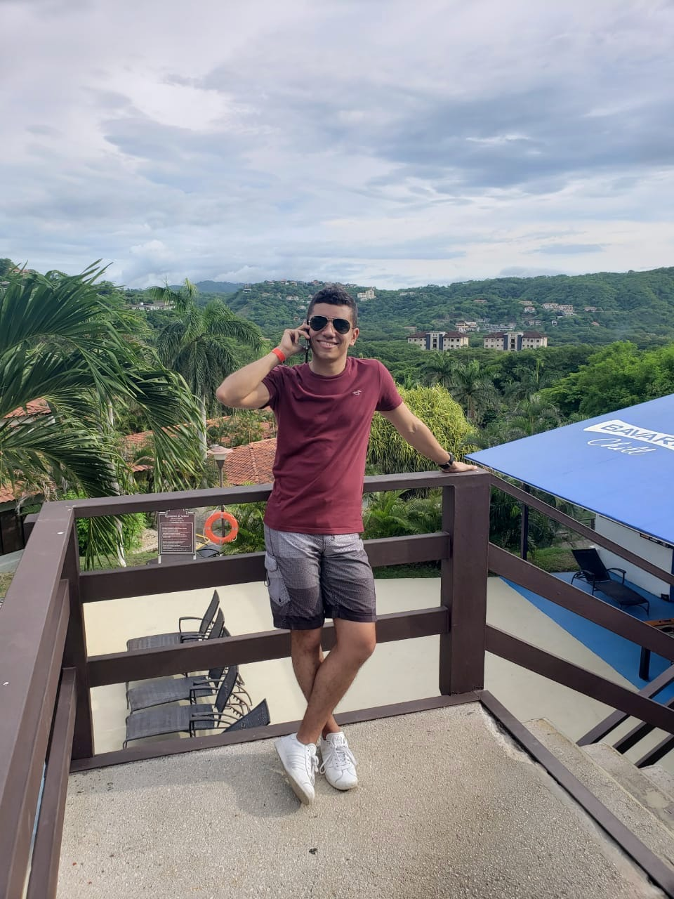
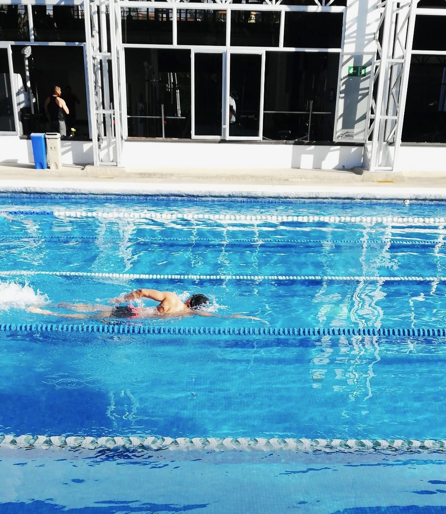

```{r setup, include=FALSE}
knitr::opts_chunk$set(echo = FALSE)
```
{width=30%}

# Luis Monge

Soy estudiante de estadística, descubrí la carrera por mi pasión en los juegos
de mesa. Solo quería entender qué había detrás de las cartas con las que
disfrutaba jugar y competir contra mis amigos. Esa misma emoción con la que
practicaba todos los días en los juegos es la que me motiva ahora a programar
y analizar datos.

#### Interesés

##### R

El lenguaje de programación de R es lo que le da vida a este blog,literalmente,
este sitio web lo edito en Rstudio, lo subo a mi repositorio en Github y luego
Netlify lo renderiza en esta página web. Esto es tan solo una pizca de las
infinitas posiblidades de tareas que son realizables en R.

R no es solo una herramienta, también es una comunidad cálida, innovadora y
segura para aprender y desarrollar nuevas herramientas. En este blog pueden
encontrar varios recursos que utilizo para mantenerme al día con los nuevos
trucos y prácticas que se generan.

##### Natación

Nadar es la actividad deportiva que elegí para mantenerme activo. Me encanta
el ejercicio, disfruto practicar en la piscina, entrenar con peso en un gimnasio
y competir nadando en aguas abiertas.

Al igual que en R, no solo se trata de mí. Los amigos que he conocido nadando
son las personas más vivas que conozco, siempre están listos para entrenar a
cualquier hora y me enseñaron la disciplina para hacer lo mismo por meses con
tal de ser un poquito mejor cada día.

{width=30%}

##### Spider-man

Cualquiera puede ponerse la máscara! Mis amigos más cercanos conocen lo mucho
que me encanta este personaje. Ese sentido de poder y responsabilidad por un
bien común es lo que potencia la idea de compartir mis habilidades y lo que
estoy aprendiendo. Cualquiera puede aprender a programar para hacer su trabajo
más fácil y eficiente, para entender mejor los datos que lo rodean o por lo
divertido que puede ser comunicarse con una computadora para completar una
tarea.

Al final del día siempre hacer lo que está bien! Todos enfrentamos problemas
y el mensaje que me quedó luego de leer las primeras 100 apariciones del 
personaje en los comics es: por más que todas las posibilidades estén en 
nuestra contra y nadie se tome el tiempo de conocer nuestras verdaderas 
intenciones lo que realmente importa es hacer el bien en todas las oportunidades 
que se nos presentan.

{width=50%}